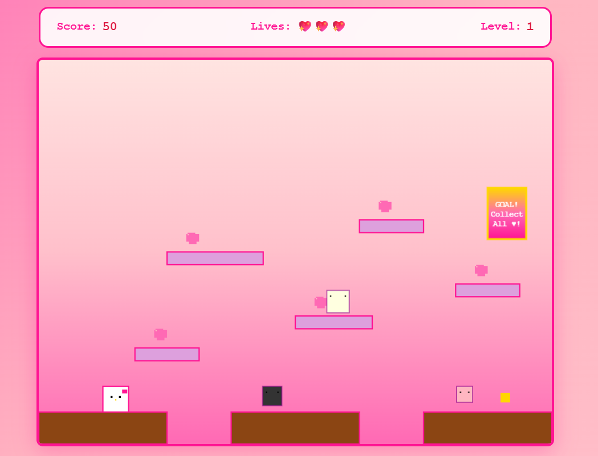

# 🎀 Hello Kitty Game — Lokalno pokretanje



## ✅ Preduslovi

Instaliraj sljedeće alate i provjeri verzije:

```bash
# Node.js (verzija 16+)
node --version

# Python (verzija 3.8+)
python --version

# MongoDB
mongod --version

# Yarn
yarn --version
```

---

## 1) Backend (FastAPI)

```bash
# Idi u backend folder
cd backend

# Instaliraj Python dependencies
pip install -r requirements.txt

# Kreiraj .env fajl (primjer)
# MONGO_URL i DB_NAME prilagodi po potrebi
echo "MONGO_URL=mongodb://localhost:27017/hellokitty
DB_NAME=hellokitty" > .env

# Pokreni MongoDB (u novom terminalu)
mongod

# Pokreni backend server (sa hot-reload)
uvicorn server:app --host 0.0.0.0 --port 8001 --reload
```

> **Napomena:** Komanda iznad pretpostavlja da je ulazna tačka `server.py` sa FastAPI aplikacijom `app`.

---

## 2) Frontend (React)

```bash
# U novom terminalu, idi u frontend folder
cd frontend

# Instaliraj dependencies
yarn install

# Kreiraj .env fajl sa URL-om backend-a
echo "REACT_APP_BACKEND_URL=http://localhost:8001" > .env

# Pokreni frontend development server
yarn start
```

---

## 3) Otvori igru

* Frontend: [http://localhost:3000](http://localhost:3000) 🎮
* Backend API: [http://localhost:8001/api](http://localhost:8001/api)

---

## 4) Struktura projekta

```
super-kitty/
├── frontend/          # React igra
│   ├── src/components/
│   ├── src/utils/
│   └── package.json
├── backend/           # FastAPI server
│   ├── server.py
│   └── requirements.txt
└── README.md
```

---

## 5) Razvoj (Development)

* **Frontend hot reload:** automatski se osvježava kad mijenjaš kod
* **Backend hot reload:** koristi `--reload` flag (kao u komandi gore)
* **MongoDB:** pokrećeš jednom, radi u pozadini

---

## 🔧 Troubleshooting

**Port 3000 je zauzet (React):**

```bash
PORT=3001 yarn start
```

**MongoDB ne radi:**

```bash
# macOS (Homebrew)
brew services start mongodb-community

# Linux (systemd)
sudo systemctl start mongod
```

**Ponovna instalacija frontend paketa:**

```bash
rm -rf node_modules && yarn install
```

**Windows napomena (kreiranje .env):**
Ako `echo` ne napravi novi red u .env, otvori `.env` u editoru i nalijepi:

```
MONGO_URL=mongodb://localhost:27017/hellokitty
DB_NAME=hellokitty
```

---

## 💡 Savjeti

* Provjeri da li frontend `.env` varijable počinju sa `REACT_APP_` (Create React App zahtjev).
* Ako koristiš `pyenv`/virtualenv, aktiviraj okruženje prije `pip install`.
* Uvjeri se da je `CORS` dozvoljen na backendu za `http://localhost:3000` tokom razvoja.